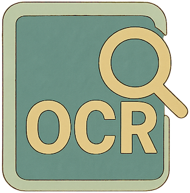

---
hide:
  - navigation
---
# 欢迎来到 MyOCR 文档

    

**MyOCR 是一个高度可扩展且易于定制的框架，专为简化生产级 OCR 系统的开发和部署而设计。**

通过 MyOCR，您可以轻松训练自定义模型，并将其无缝集成到您的 OCR 方案中。

## 主要特性

**⚡️ 端到端 OCR 开发框架** – 为开发者打造，帮助您在统一灵活的流程中构建和集成检测、识别以及自定义 OCR 模型。

**🛠️ 模块化与可扩展性** – 自由组合各种组件，以最小的改动即可替换模型、预测器或输入输出处理器。

**🔌 对开发者友好的设计** - 清晰的 Python API、预构建的流水线和处理器，让训练和推理的自定义变得简单直观。

**🚀 生产就绪的性能表现** – 支持 ONNX runtime 实现快速 CPU/GPU 推理，提供多种部署方式。

## 快速入门

1.  **[安装](./getting-started/installation.md):** 配置 MyOCR 并下载必要的模型。
2.  **[概览](./getting-started/overview.md):** 了解核心概念（模型、预测器、流水线），为构建您的 OCR 能力打下基础。
3.  **[推理指南](./inference/local.md):** 学习如何使用 MyOCR 执行 OCR 任务。

## 核心概念

*   **[模型](./models/index.md):** 了解支持的模型类型（ONNX、PyTorch、自定义模型）及其架构。
*   **[预测器](./predictors/index.md):** 了解模型如何与输入/输出处理器结合成为 `Predictor`。
*   **[流水线](./pipelines/index.md):** 探索如何协调多个预测器，实现端到端 OCR 的高级流水线。

## 其他资源

*   **[常见问题解答](./faq.md):** 查找常见问题的解答。
*   **[更新日志](./CHANGELOG.md):** 查看最近的更新和变化。
*   **[贡献指南](./CONTRIBUTING.md):** 了解如何为项目做出贡献。
*   **[GitHub 仓库](https://github.com/robbyzhaox/myocr):** 源代码、问题和讨论。

## 许可证

MyOCR 采用 [Apache 2.0 许可证](https://github.com/robbyzhaox/myocr/blob/main/LICENSE) 开源。
